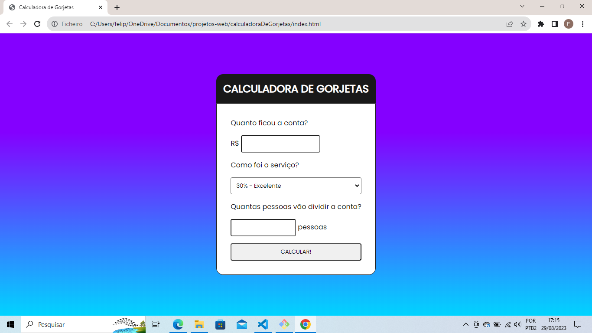

# Calculadora de Gorjetas

Uma simples calculadora de gorjetas desenvolvida em HTML, CSS e JavaScript.

## Funcionalidades

- Insira o valor total da conta.
- Selecione a porcentagem de gorjeta com base na qualidade do serviço.
- Especifique o número de pessoas para dividir a conta.
- Calcule a gorjeta individualmente.

## Pré-requisitos

Nenhum. Basta um navegador web moderno para executar a aplicação.

## Como Usar

1. Clone este repositório para o seu ambiente local.
2. Abra o arquivo `index.html` em um navegador web.

## Capturas de Tela

## Personalização

- Você pode ajustar as cores, fontes e estilos no arquivo `index.css`.
- Modificações no comportamento e cálculos podem ser feitas no arquivo `index.js`.

## Contribuição

Contribuições são bem-vindas! Se você tiver melhorias, correções ou recursos adicionais, fique à vontade para enviar um pull request.

## Licença

Este projeto está licenciado sob a [Licença MIT](./LINCENSE.md).

---
Desenvolvido por [Felipe Silva](https://github.com/felipe-silva-124)
